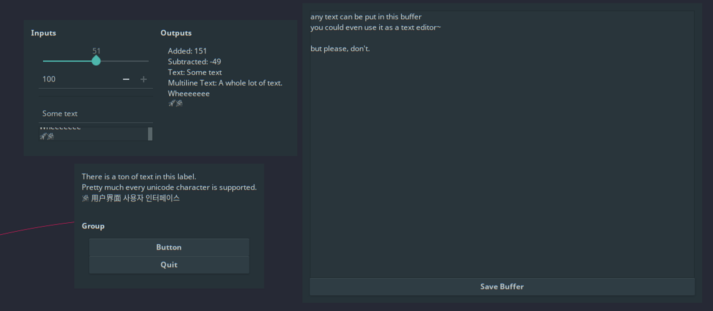

# Improved User Interface
## A cross-platform UI toolkit for Rust based on libui
[](https://travis-ci.org/LeoTindall/libui-rs/)
[](https://ci.appveyor.com/project/LeoTindall/libui-rs)
[](https://isitmaintained.com/project/LeoTindall/libui-rs)
[](https://isitmaintained.com/project/LeoTindall/libui-rs)


iui: [](https://crates.io/crates/iui/)
[](https://docs.rs/iui)
ui-sys: [](https://crates.io/crates/ui-sys/)
[](https://docs.rs/ui)

`iui` is a simple, small, easy to distribute GUI library, a Rusty user interface library that binds to platform native APIs.
These are work-in-progress bindings to the minimalistic native UI library [libui][libui] via the `ui-sys` bindings crate.

Add `iui` to your project with:

```toml
iui = "0.2"
```

## Organization

`iui` is the safe Rust wrapper, to be used by most users.
`ui` is the old version of the safe wrapper. Don't use this.
`ui-sys` is the raw unsafe bindings to the `libui` C code. Requires `cmake` so it can build `libui`.
`libui` is included as a submodule. You will need CMake to build `libui` itself.

Based on work by [@pcwalton](https://github.com/pcwalton/). Licensed MIT.

## Example



```rust
extern crate iui;
use iui::prelude::*;
use iui::controls::{Label, Button, VerticalBox, Group};

fn main() {
    // Initialize the UI library
    let ui = UI::init().expect("Couldn't initialize UI library");
    // Create a window into which controls can be placed
    let mut win = Window::new(&ui, "Test App", 200, 200, WindowType::NoMenubar);

    // Create a vertical layout to hold the controls
    let mut vbox = VerticalBox::new(&ui);
    vbox.set_padded(&ui, true);

    let mut group_vbox = VerticalBox::new(&ui);
    let mut group = Group::new(&ui, "Group");

    // Create two buttons to place in the window
    let mut button = Button::new(&ui, "Button");
    button.on_clicked(&ui, {
        let ui = ui.clone();
        move |btn| {
            btn.set_text(&ui, "Clicked!");
        }
    });

    let mut quit_button = Button::new(&ui, "Quit");
    quit_button.on_clicked(&ui, {
        let ui = ui.clone();
        move |_| {
            ui.quit();
        }
    });

    // Create a new label. Note that labels don't auto-wrap!
    let mut label_text = String::new();
    label_text.push_str("There is a ton of text in this label.\n");
    label_text.push_str("Pretty much every unicode character is supported.\n");
    label_text.push_str("🎉 用户界面 사용자 인터페이스");
    let label = Label::new(&ui, &label_text);

    vbox.append(&ui, label, LayoutStrategy::Stretchy);
    group_vbox.append(&ui, button, LayoutStrategy::Compact);
    group_vbox.append(&ui, quit_button, LayoutStrategy::Compact);
    group.set_child(&ui, group_vbox);
    vbox.append(&ui, group, LayoutStrategy::Compact);

    // Actually put the button in the window
    win.set_child(&ui, vbox);
    // Show the window
    win.show(&ui);
    // Run the application
    ui.main();
}
```

## Building ui-sys

`ui-sys` includes `libui` as a sub-module and allows it to be built on-the-fly with the
default features `fetch` and `build. With `fetch disabled, it will simply build the
existing sources without updating them, and with `build` disabled it will build nothing,
assuming either a system or local (in `./lib/`) version of `libui` is available.

Note that _most of the time_, building `libui` on the fly is what you want. It does however
require a copy of cmake, essential build tools, et cetera.
